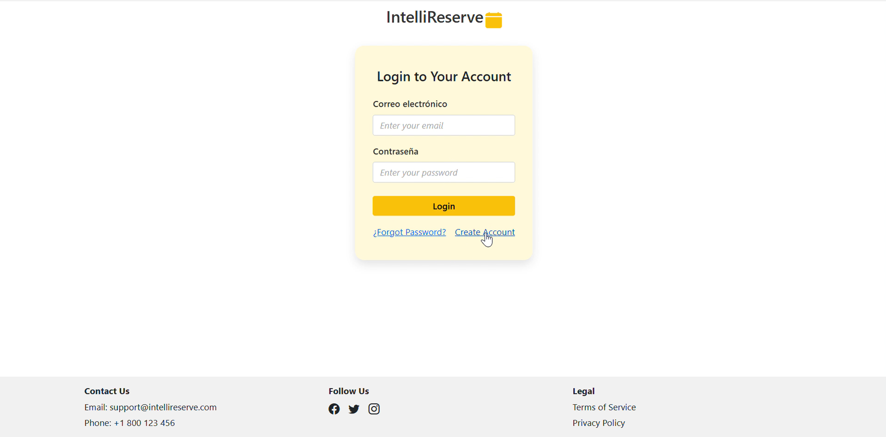
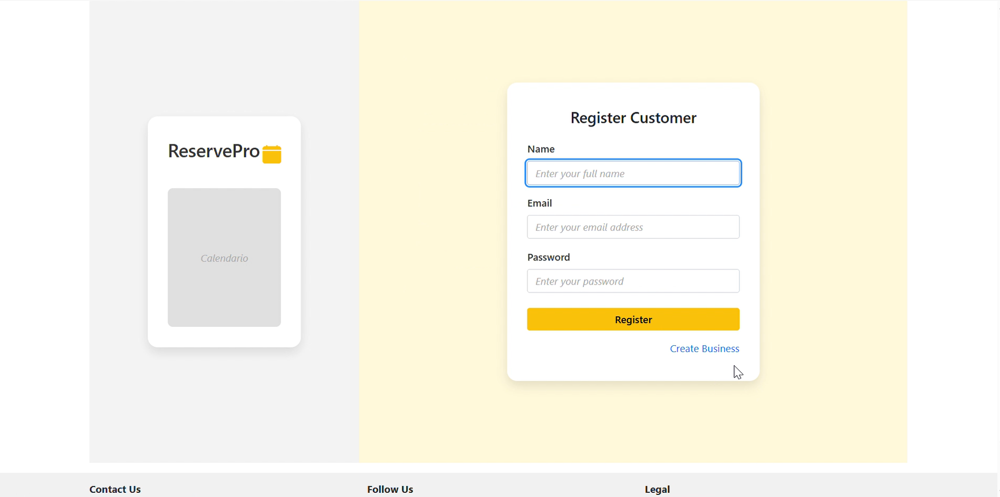
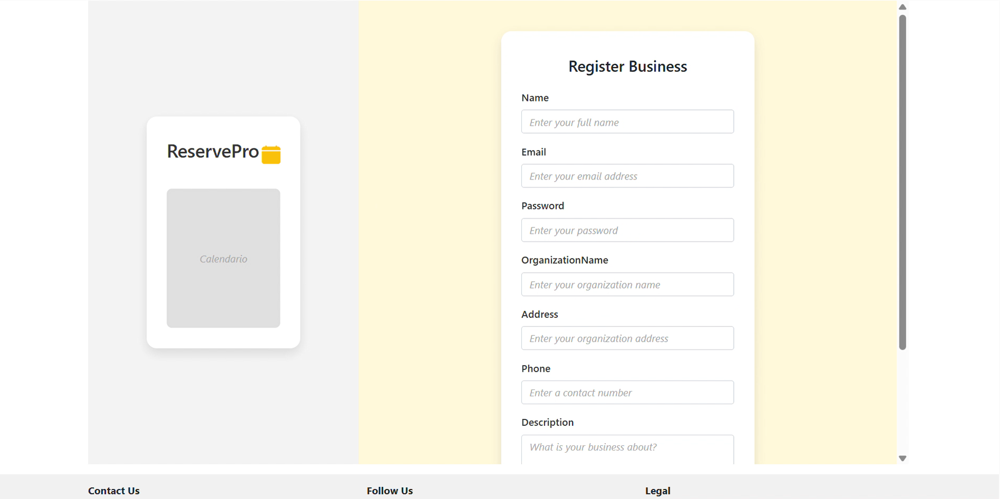
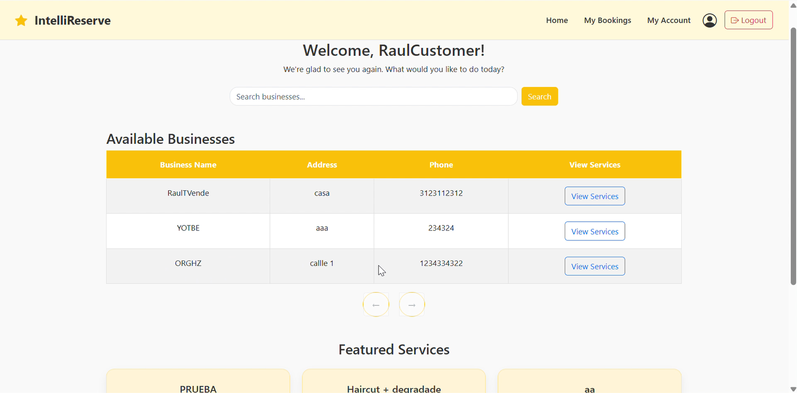
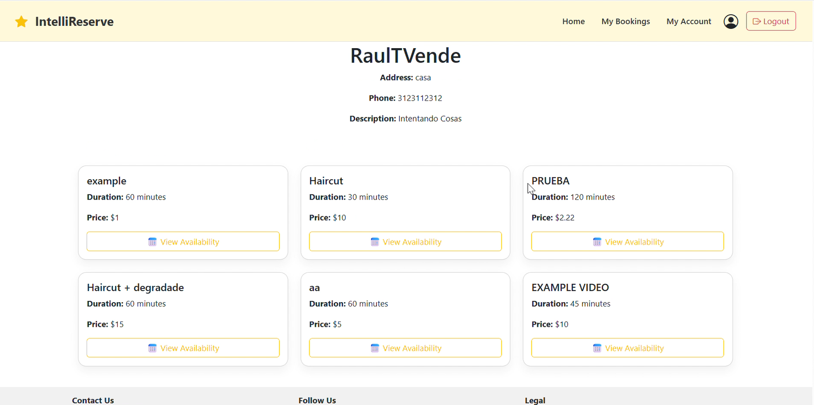
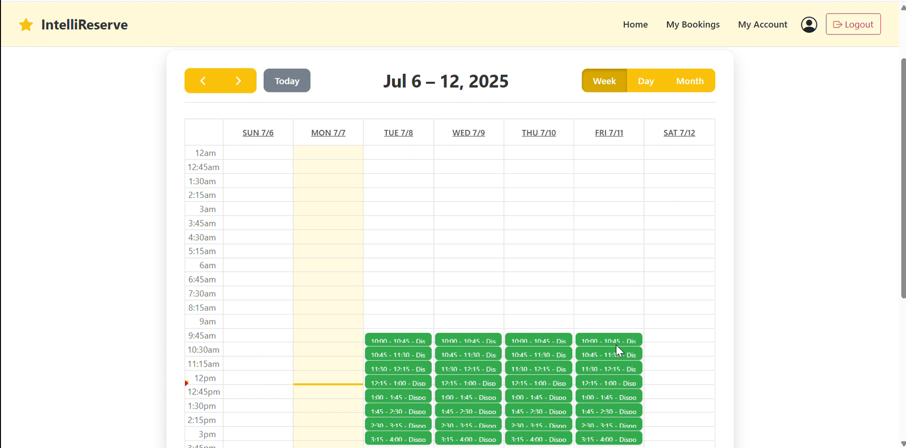
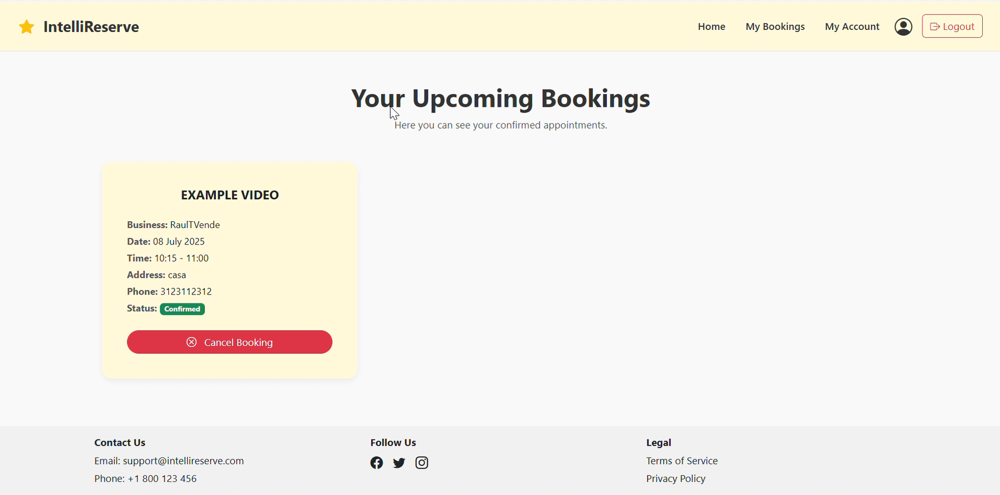
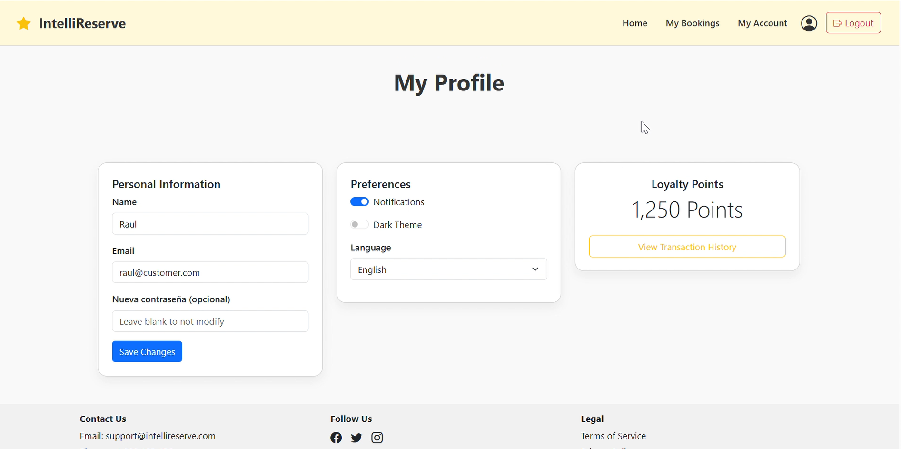
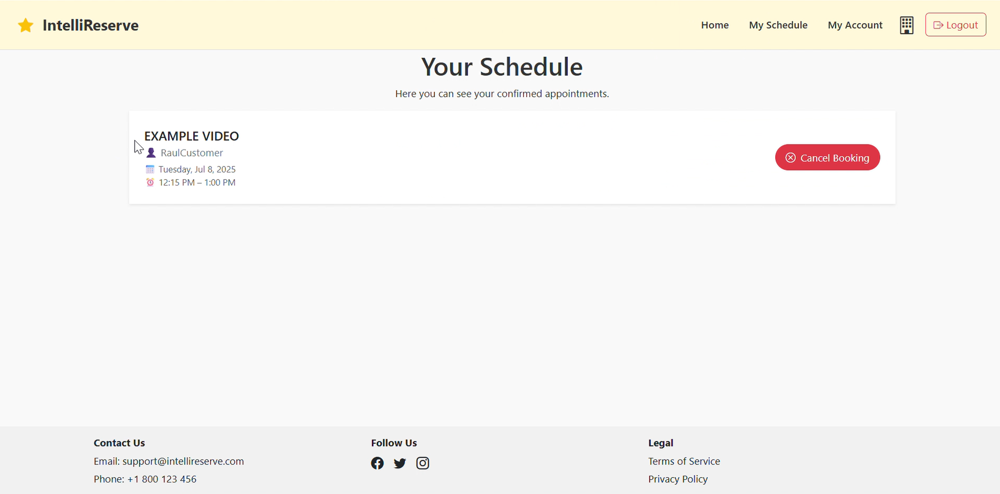
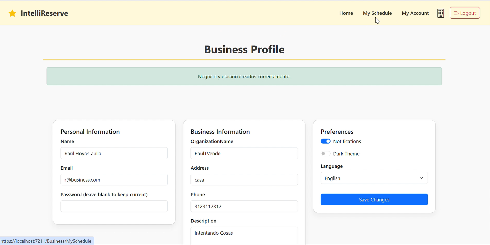

# IntelliReserve

> University project for the course *IT Applications – Electronic Media in Business & Commerce*
> Made by 5 students

## 🧠 Description
**IntelliReserve** is a web-based booking platform designed for small businesses such as hair salons 💇‍♀️, sports centers 🏋️, or any service that operates with scheduled appointments.  

The application distinguishes between two types of users:  

- **Customers 👤**: can search for businesses, book services, view and cancel their appointments, and receive personalized recommendations based on their booking history through a lightweight AI system.  
- **Businesses 🏢**: can create and organize their services, define available schedules, manage incoming bookings, and access business statistics to optimize their operations.  

In short, IntelliReserve centralizes appointment management and makes the interaction between clients and businesses more efficient.  
---

## ⚙️ Technologies used

- **Frontend:** ASP.NET MVC 💻 | HTML 🎨 | CSS 🎨
- **Backend:** C# ⚙️ | .NET Framework 🚀
- **Database (opcional):** PostgreSQL 🗄️
- ChatGPT API (service recommendations)🚧

---

## 🗃️ Database structure (UML)

- `User` – platform users, including **clients** 👤 who can make bookings; stores login info, roles, and relationships to appointments and   **Business Owner**  responsible for managing the company and creating all its services
- `Business` – registered companies 🏢; each business can have multiple services and employees.  
- `Employee` – employees of a business.  
- `Service` – offerings from each business (e.g., haircut, manicure); linked to multiple `ServiceSchedules` and `ServiceAvailabilities`.  
- `ServiceSchedule` – specific scheduled times for a service; linked **one-to-one** with an `Appointment`.  
- `ServiceAvailability` – available days/times for a service.  
- `Appointment` – booked service by a client, linked to a `User` (customer) and a `ServiceSchedule`.  
- `Payment` – payments associated with appointments.  
- `Review` – user feedback about services or businesses.  
- `Notification` – notifications for users or businesses.  
- `Schedule` – general schedules (if used).  

---

## 🚀 Next Steps

IntelliReserve is partially completed. The following features are planned to enhance the platform's functionality and user experience:

- [ ] Develop an interactive calendar for businesses to efficiently manage schedules and visualize all bookings at a glance.  
- [ ] Integrate a secure and seamless payment system for appointments.  
- [ ] Enable assigning specific employees to services, improving service management and client experience.  
- [ ] Implement a robust notification system to keep clients and businesses informed of updates and changes.  
- [ ] Add a review and feedback mechanism to allow clients to rate services and provide insights for businesses.  

---

## 🖼️ Screenshots

### MAIN INTERFACE
#### Login

#### Registration Customer

#### Registration Business

### CUSTOMER

#### Home Customer

#### Services Customer

#### Schedule Customer

#### Booking Customer

#### Profile Customer

### BUSINESS

#### Home Business

#### Create / Edit Services

#### SChedule Business

#### Profile Business

## License
This project is licensed under the MIT License. [LICENSE](LICENSE) file for details.

## 📬 Contact
- **Raúl Hoyos** – raulhzmgl@gmail.com  
- **GitHub Repository**: [RaulHoyoss](https://github.com/RaulHoyoss)
